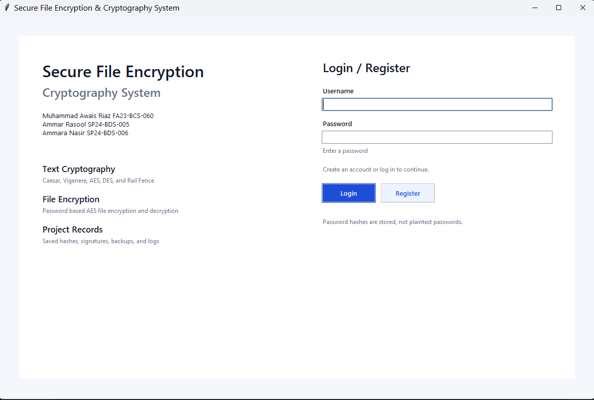
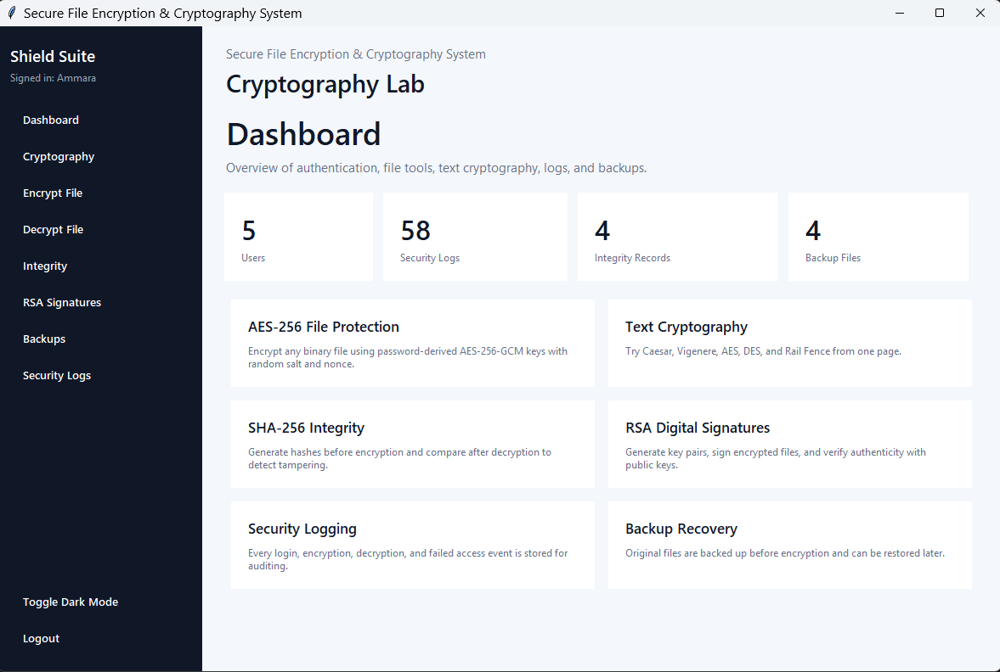
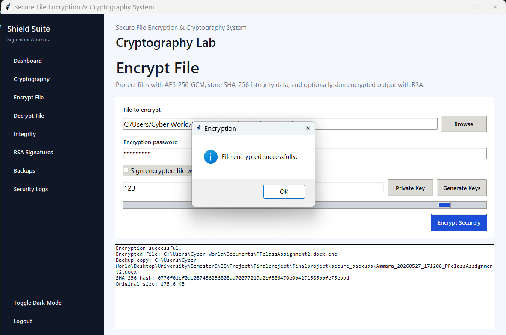
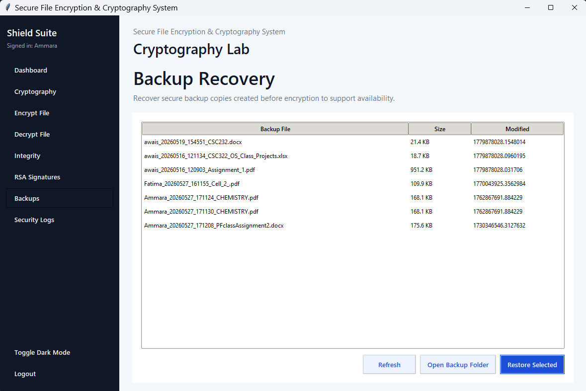

# Secure File Encryption & Cryptography System

## Abstract

Secure File Encryption & Cryptography System is a desktop application developed for a BS Computer Science Information Security semester final project. It allows authenticated users to encrypt and decrypt files, verify SHA-256 hashes, create RSA digital signatures, maintain audit logs, recover backups, and test common text encryption methods from one Cryptography tab.

## Problem Statement

Students need a practical project that shows how cryptographic tools protect data. The system gives a simple GUI for file encryption, text encryption, hashing, signatures, database records, and backup recovery.

## Objectives

- Build a desktop application with user authentication.
- Add a plain text cryptography tab.
- Encrypt files using AES-256-GCM.
- Decrypt files only with the correct password.
- Generate and verify SHA-256 hashes.
- Add RSA digital signature support.
- Store events in SQLite logs.
- Provide backup and recovery features.

## Methodology

The system is built in Python 3 with a modular architecture. Tkinter provides the GUI, SQLite stores users/logs/integrity records, `hashlib` generates SHA-256 hashes, and the `cryptography` library provides AES-GCM, PBKDF2, RSA-PSS, TripleDES, and X25519.

After login, the user can open the Cryptography tab, enter text, choose an encryption type, enter a key, and encrypt or decrypt the text. For files, the application calculates the SHA-256 hash, creates a backup, encrypts the bytes with AES-256-GCM, stores a record in SQLite, and optionally signs the encrypted file with RSA.

## Algorithms Used

### Caesar

Caesar shifts alphabet letters by a number. The same number in reverse decrypts the text.

### Vigenere

Vigenere uses a word key and repeats its letter shifts across the message.

### AES-256-GCM

AES-256-GCM encrypts file bytes and plain text with random salts/nonces. GCM authenticates the encrypted data.

### DES

The DES option uses the TripleDES implementation available in the `cryptography` library with CBC mode and PKCS7 padding.

### Rail Fence

Rail Fence writes characters in a zigzag pattern across rails and then reads each rail to form the cipher text.

### Diffie-Hellman

The Diffie-Hellman option uses X25519 to derive a shared key and then uses AES-GCM for the actual text encryption.

### SHA-256

SHA-256 is used for password hashes and file hash records.

### RSA-PSS

RSA-PSS signs encrypted files. The private key signs, and the public key verifies.

## System Architecture

```text
User
  |
  v
Tkinter GUI Dashboard
  |
  +-- Authentication Module -> SQLite users table
  +-- Cryptography Module -> text encryption and decryption
  +-- Encryption Module -> AES-256-GCM + SHA-256 + backups
  +-- Decryption Module -> AES-GCM auth + hash verification
  +-- Signature Module -> RSA key generation/sign/verify
  +-- Logs Module -> SQLite logs table + audit log file
```

## Database Design

### Users

| Field | Purpose |
|---|---|
| id | Unique user ID |
| username | Login identity |
| password_hash | SHA-256 password hash |
| failed_attempts | Lockout counter |
| locked_until | Temporary account lock time |
| created_at | Account creation timestamp |

### Logs

| Field | Purpose |
|---|---|
| id | Unique event ID |
| username | User responsible for event |
| action | Event/action name |
| filename | Related file path |
| timestamp | Event time |

### Integrity

| Field | Purpose |
|---|---|
| id | Unique record ID |
| username | Owner |
| filename | Original file path |
| encrypted_filename | Encrypted file path |
| hash_value | Original SHA-256 file hash |
| signature_path | Optional RSA signature path |
| timestamp | Record creation time |

## Error Handling

The application handles wrong passwords, corrupted encrypted files, unsupported formats, missing keys, missing signatures, missing files, invalid signatures, and database errors using message boxes and audit logs.

## Testing Results

| Test Case | Expected Result | Status |
|---|---|---|
| Register new user | User stored in SQLite | Passed |
| Duplicate registration | Error message shown | Passed |
| Correct login | Dashboard opens | Passed |
| Wrong login repeatedly | Account lockout occurs | Passed |
| Encrypt text with Caesar | Shifted text shown | Passed |
| Decrypt text with Caesar | Original text restored | Passed |
| Encrypt text with AES | JSON cipher package shown | Passed |
| Decrypt text with AES | Original text restored | Passed |
| Encrypt text with Rail Fence | Rail cipher shown | Passed |
| Encrypt file | `.enc` file created | Passed |
| Decrypt with correct password | Original content restored | Passed |
| Decrypt with wrong password | Error shown, no crash | Passed |
| Generate SHA-256 | Hash displayed | Passed |
| Compare stored hash | Match/mismatch result displayed | Passed |
| Generate RSA keys | PEM files created | Passed |
| Sign encrypted file | `.sig` file created | Passed |
| Verify valid signature | Success message shown | Passed |
| Backup restore | Backup copied to chosen folder | Passed |

# 📸 Screenshots
### Login Screen

### Dashboard

### Encryption Panel

### Backup Recovery Screen

## Conclusion

The project demonstrates practical cryptography concepts in a desktop application. It combines authentication, text ciphers, AES file encryption, SHA-256 hashing, RSA digital signatures, audit logging, and backup recovery in a way that is clear for a semester final project.

## Future Enhancements

- Use Argon2 or bcrypt for production-grade password storage.
- Protect private RSA keys with passphrases.
- Add role-based access control.
- Add PDF report export from inside the GUI.
- Add drag-and-drop file upload.
- Add OTP verification through email or authenticator apps.
- Add QR-based public key export.
- Add cloud backup integration.
- Add automated test suite with temporary files.

